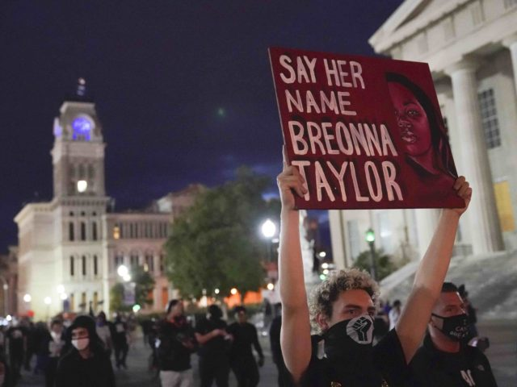

# Louisville Hate Crimes
### By Shala Mudd

## About

This project will be about Louisville Kentucky hate crimes. Specifically against African Americans, and  how they raised after the murder of Breonna Taylor. Breonna Taylor was a 26 year old African American  killed by the Louisville police department on March 13th 2020. There were "Black Lives Matter" protest that took place after the news spread about this incident. Very emotional, and scary time in this city.

## Source

All data was sourced from data.louisvilleky.gov

## Running This Program 

1. Have Python 3 installed on your machine.
2. Clone my repository 
3. Create a virtual environment (optional)
4. From within that directory pip install the requirements.txt file by running "pip install -r requirements.txt".

The following packages will be required to run the program: 
* pandas 
* numpy
* matplotlib.pyplot

## Code Louisville Requirements Met
- Category 1:
    - Read in data from a local csv, excel file, json, or any other file type.
- Category 2:
    - Use built-in pandas or numpy functions
- Category 3:
    - Use at least 5 different built-in Python functions to find out something about your data
- Category 4:
    - Make 2 basic plots with matplotlib, seaborn, or any other kind of visualization library that you think looks interesting.
